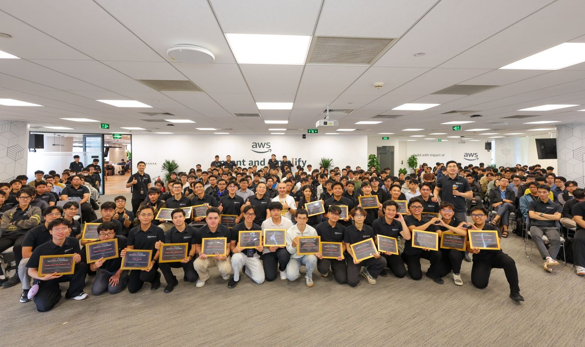

# Event Meetup Reflection Report

### Purpose of the Event
-The participating teams shared their experiences from the **Agentic AI Build Week (AABW) 2026** journey.
-The competition teams provided a comprehensive overview of their idea development process, solution architecture, workflow, technologies used, and the practical lessons learned while building products under tight time constraints.
-**Mr. Giuseppe Marazzotta** delivered a presentation on the evolution of Artificial Intelligence (AI).

### What I Learned
-Gained valuable knowledge about participating in hackathons and learned how to better understand user needs when developing real-world applications.
-Learned about the latest AWS services and cloud infrastructure.

### Speaker List

- **University students from various universities**
- **Mr. Nguyễn Gia Hưng**
- **Mr. Giuseppe Marazzotta**

### Key Highlights
-The speakers shared their hackathon journeys, from teams that had achieved outstanding results in previous competitions to teams participating for the very first time. Their stories demonstrated the diversity of the competition and the valuable opportunities it offers.
-The presenters also provided a detailed overview of the entire product development process, including idea generation, solution architecture, workflow, technologies used, and the practical lessons learned while developing products under significant time pressure.

> Overall, the event not only provided valuable technical knowledge but also changed the way I think about application design, system modernization, and effective collaboration across teams.
