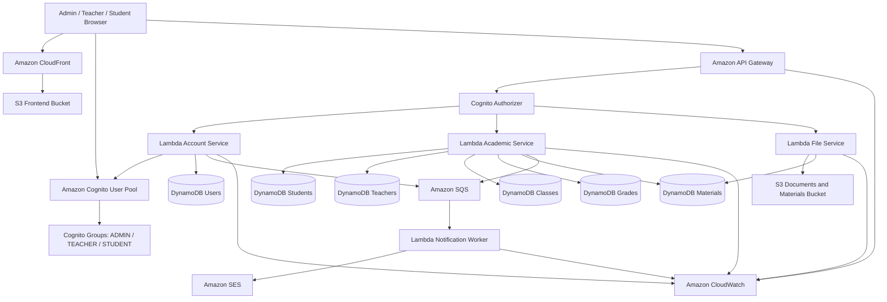

### Project Introduction

**AWS Student Management Portal** is a web application built entirely on a **Serverless architecture on AWS**. The system enables the management of student academic information, profiles, and files through an intuitive web interface.

The system serves three user groups:
* **Admin**: Manages user accounts, configures Cognito user groups, and monitors system logs.
* **Teacher**: Manages assigned classes, inputs and edits grade sheets, and uploads learning materials.
* **Student**: Views personal profile, queries grade reports, and accesses learning materials posted by teachers.

---

### System Architecture

The application is designed using a Serverless model to eliminate server management overhead (no EC2), scale automatically under load, and minimize costs.

---

### Key Infrastructure Components

| Component | AWS Service | Role |
| :--- | :--- | :--- |
| **Static Web** | Amazon S3 + CloudFront | Hosting & CDN distribution for the static React App |
| **Authentication** | Amazon Cognito | Manages user sign-in, issues JWT tokens, and handles group-based authorization |
| **API Gateway** | Amazon API Gateway | Hosts REST APIs and secures routes using a Cognito Authorizer |
| **Compute** | AWS Lambda | Executes Node.js backend logic for student, teacher, grade, and file services |
| **Database** | Amazon DynamoDB | Low-latency NoSQL storage for users, classes, grades, and file metadata |
| **Storage** | Amazon S3 | Stores documents and learning materials securely via **Presigned URLs** |
| **Queue** | Amazon SQS | Buffers asynchronous notifications to prevent system throttling |
| **Email** | Amazon SES | Sends automatic notification emails (credentials, grade releases) |
| **Monitoring** | Amazon CloudWatch | Captures application logs, tracks Lambda execution times and errors |

---

### Core Data Flows

#### 1. Authentication & Authorization
* Users log in via the Frontend → receive a JWT Token from **Cognito User Pool**.
* Frontend decodes user roles (`ADMIN`, `TEACHER`, `STUDENT`) from the token to govern UI navigation.
* All API requests must include the JWT token in the `Authorization` header. **API Gateway** uses a Cognito Authorizer to validate the token before invoking any **Lambda** functions.

#### 2. File Upload Workflow (Learning Materials)
* A teacher requests to upload a file → Frontend calls API Gateway → Lambda generates a short-lived **S3 Presigned URL**.
* Frontend uploads the file directly to the **S3 Bucket** via this Presigned URL, offloading file bandwidth from Lambda.
* Once the upload completes, Frontend calls the API to save metadata to **DynamoDB** and pushes a notification message into **SQS**.
* **Lambda Notification Worker** consumes the message from SQS and triggers **SES** to send email notifications to students.
