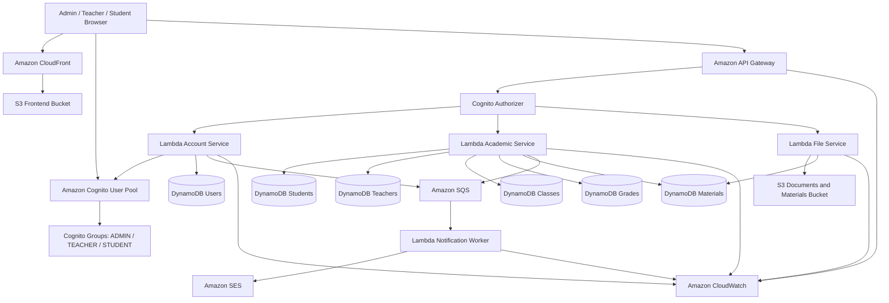

### Giới thiệu dự án

**AWS Student Management Portal** là một ứng dụng web được xây dựng hoàn toàn theo kiến trúc **Serverless trên AWS**. Hệ thống cho phép quản lý thông tin học tập, hồ sơ và tài liệu của sinh viên thông qua giao diện web trực quan.

Hệ thống phục vụ ba nhóm người dùng:
* **Admin (Quản trị viên)**: Quản lý tài khoản người dùng, phân quyền nhóm Cognito, theo dõi logs hoạt động.
* **Teacher (Giáo viên)**: Quản lý lớp học được phân công, nhập và chỉnh sửa điểm số, đăng tài liệu học tập.
* **Student (Sinh viên)**: Xem hồ sơ cá nhân, tra cứu điểm số, xem và tải tài liệu học tập do giáo viên đăng tải.

---

### Kiến trúc tổng quan (Architecture)

Ứng dụng được thiết kế tối ưu với mô hình Serverless để loại bỏ việc quản trị máy chủ (no EC2), tự động mở rộng theo tải và tối ưu hóa chi phí.

---

### Các thành phần chính trong hệ thống

| Thành phần | AWS Service | Vai trò |
| :--- | :--- | :--- |
| **Web tĩnh** | Amazon S3 + CloudFront | Hosting & CDN phân phối giao diện React App tĩnh |
| **Xác thực** | Amazon Cognito | Quản lý đăng nhập, cấp JWT token và phân quyền qua Groups |
| **Cổng API** | Amazon API Gateway | Tiếp nhận các REST API requests và bảo mật bằng Cognito Authorizer |
| **Backend** | AWS Lambda | Thực thi logic nghiệp vụ (Node.js) cho sinh viên, giáo viên, điểm số và tài liệu |
| **CSDL** | Amazon DynamoDB | Lưu trữ phi cấu trúc dữ liệu người dùng, lớp học, điểm và metadata tài liệu |
| **Lưu trữ File** | Amazon S3 | Lưu trữ tài liệu học tập và hồ sơ sinh viên qua cơ chế **Presigned URL** |
| **Hàng đợi** | Amazon SQS | Tiếp nhận sự kiện gửi thông báo bất đồng bộ để chống nghẽn |
| **Gửi Email** | Amazon SES | Gửi email thông báo tự động (thông tin đăng nhập mới, cập nhật học thuật) |
| **Giám sát** | Amazon CloudWatch | Theo dõi hệ thống logs, lưu trữ lỗi và hiệu năng của Lambda/API Gateway |

---

### Các luồng xử lý chính

#### 1. Đăng nhập và phân quyền
* Người dùng đăng nhập từ Frontend → nhận JWT Token từ **Cognito User Pool**.
* Frontend phân tích role từ Token (`ADMIN`, `TEACHER`, `STUDENT`) để điều hướng giao diện.
* Mọi API request đều gửi kèm Token qua header `Authorization`. **API Gateway** dùng Cognito Authorizer để kiểm tra token trước khi chuyển tiếp sang **Lambda**.

#### 2. Luồng Tải lên (Upload) Tài liệu học tập
* Giáo viên chọn upload file → Frontend gọi API Gateway → Lambda tạo một **S3 Presigned URL** có thời hạn ngắn.
* Frontend sử dụng Presigned URL này để tải file trực tiếp lên **S3 Bucket** (giúp giảm tải cho backend Lambda).
* Sau khi upload thành công lên S3, Frontend gọi API lưu metadata tài liệu vào **DynamoDB** và gửi một thông báo vào **SQS**.
* **Lambda Notification Worker** tiêu thụ message từ SQS và kích hoạt **SES** gửi email thông báo cho học sinh.
